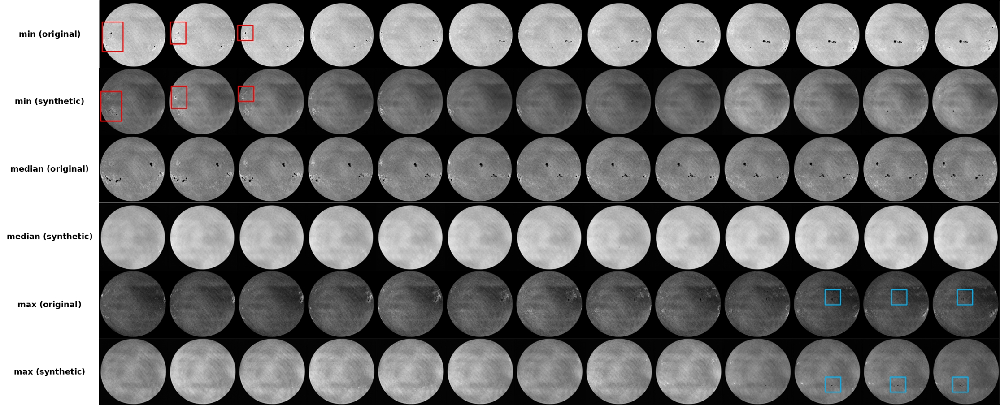
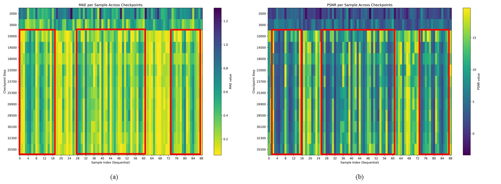

# Exploring the Use of Text-to-Video Models in Reconstructing Solar Observations from Solar Light Curve

[](https://opensource.org/licenses/Apache-2.0)

A deep learning model for reconstructing solar continuum intensity maps from total brightness curves, based on Open-Sora text-to-video generation architecture.

## Overview

Understanding stellar activity is crucial for assessing exoplanet habitability. However, for stars other than the Sun, observational limitations typically only allow for low-resolution data like integrated brightness curves, making it difficult to directly study their surface structures. This project leverages advanced deep learning techniques to reconstruct high-resolution solar images from simple light curves, aiming to establish methodologies that could potentially be applied to other stars.

Our approach modifies the Open-Sora 1.2 text-to-video model architecture by introducing a Fourier Encoder specifically designed for encoding time-series light curve data, enabling the model to map brightness variations to spatial features on the solar surface.

## Repository Structure


```
sunspot-with-sora/
├── Data-process/                     # Data preprocessing pipeline
│   ├── brightness/                   # Light curve processing tools
│   │   ├── cal_brightness.py         # Calculate brightness series from distance-normalized LD data
│   │   └── norm_timeseries.py        # Normalize time series data
│   │
│   └── figure/                       # Image processing utilities
│       ├── downsample/               # Tools for downsampling images
│       └── norm/                     # Normalization utilities
│           ├── norm_distance.py      # Normalize distance measurements
│           └── norm_figure.py        # Map image data range to [0, 255]
│
├── Fine_tune/                        # Model fine-tuning components
│   ├── utils/                        # Utility functions for training
│   ├── vae/                          # Code for VAE fine-tuning (deprecated)
│   ├── configs/                      # Configuration files for training
│   │   └── train/                    # Training-specific configurations
│   ├── eval/                         # Evaluation scripts and tools
│   │   └── scripts/                  # Evaluation automation scripts
│   ├── datasets/                     # Dataset construction for training
│   └── inference/                    # Inference code (under development)
│
├── origin_opensora/                  # Original Open-Sora 1.2 codebase
│   ├── opensora/                     # Core model architecture
│   │   └── datasets/
│   │       └── datasets.py           # Custom dataset class `SunObservationDataset`
│   └── models/
│       └── text_encoder/
│           └── fourier.py            # Custom Fourier encoder for light curves
│
├── scripts/                          # Utility and automation scripts
├── requirements.txt                  # Project dependencies
├── requirements-nobuild.txt          # Dependencies without build isolation
└── README.md                         # Project documentation
```

## Installation

1. Clone this repository:
```bash
git clone https://github.com/uho-33/sunspot-with-sora.git
cd sunspot-with-sora
```

2. Install dependencies:
```
pip install -r requirements.txt
pip install --no-build-isolation -r requirements-nobuild.txt
```

## Training

The model was trained in three stages.

Training was performed on a single A100 GPU for a total of 51 hours (1.5 hours for Stage 1, 21.5 hours for Stage 2, and 28 hours for Stage 3).

## Results

Our model achieves:
- Best Mean Absolute Error (MAE): 0.104 (approximately 5% relative error)
- Peak Signal-to-Noise Ratio (PSNR): 13.3 dB

The model successfully reconstructs some structural features of the solar surface, as shown in these sample outputs:



We observed interesting periodic fluctuations in model performance with a period of approximately half a year, with each low-performance period lasting about 128 days:



This periodicity may be related to the data construction method, solar activity cycles, or observation instrument characteristics.

## Citation

If you use this work in your research, please cite:

```bibtex
@misc{ma2025sunspot,
  author       = {Ma, Yufan and Ye, Junyu},
  title        = {Sunspot-with-Sora: Exploring the Use of Text-to-Video Models in Reconstructing Solar Observations from Solar Light Curves},
  year         = {2025},
  publisher    = {GitHub},
  journal      = {GitHub repository},
  url          = {https://github.com/uho-33/sunspot-with-sora},
  version      = {1.0}
}
```

## Acknowledgments

This research builds upon the Open-Sora 1.2 project from HPC-AI Tech. The data used in this study was obtained from the Solar Dynamics Observatory's Helioseismic and Magnetic Imager (HMI) instrument through JSOC.

## License

This project is licensed under the Apache License 2.0 - see the [LICENSE](LICENSE) file for details.